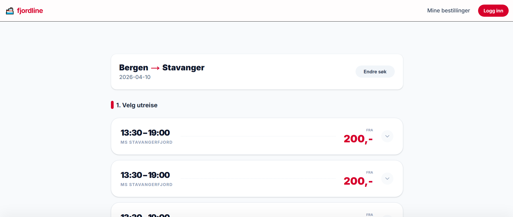

# fjordline-booking-app

This is a [Next.js](https://nextjs.org) project bootstrapped with [`create-next-app`](https://nextjs.org/docs/app/api-reference/cli/create-next-app).

## Nextjs

First, run the development server:

```bash
npm run dev
# or
yarn dev
# or
pnpm dev
# or
bun dev
```

Open [http://localhost:3000](http://localhost:3000) with your browser to see the result.

You can start editing the page by modifying `app/page.tsx`. The page auto-updates as you edit the file.

This project uses [`next/font`](https://nextjs.org/docs/app/building-your-application/optimizing/fonts) to automatically optimize and load [Geist](https://vercel.com/font), a new font family for Vercel.


## Mål og fokus
Jeg ønsker å fokusere på å skape en app som er enkel å bruke. Jeg skaper derfor en app som følger tilgjengelighet, er rask og responsiv og har et enkelt og intuitivt grensesnitt. God SEO vil også være i bakhodet.

### Eksisterende applikasjon hos Fjord Line
Deres eksisterende applikasjon er moderne, intuitiv og mobil-vennlig, og derfor prøver jeg å ta inspirasjon uten å kopiere den. Det ene jeg merker meg er at søkeargumentet ikke er lagret i URL, og at det ikke er mulig å dele søk. Det er noe jeg vil gjøre annerledes for å gjøre det enklere å dele og gjenbruke søk, selv om det også er gunstig å bruke en session av andre grunner.

## Prøblemløsning og valg

### App router vs pages router
Er mest kjent med app router, og valgte det også fordi Nextjs selv anbefaler det for nye prosjekter. Bruker også Nextjs defaults i initiering for å gjøre det enklere å komme i gang.

### Backend
Har selv bare gjort alt i ett prosjekt, og selv om jeg gjerne vil lære å sette opp separat REST-API er ikke det noe jeg tar meg tid til her, men kunne gjort med mer tid. Velger derfor å gjøre alt i ett prosjekt.

### Ruting
- /: Hovedsiden som viser søkefelt
- /departures: Siden som viser avgangsinformasjon basert på søkeargumentet
- /checkout: Siden for å fullføre bestilling gitt søkeparameterne
- /api/departures: API rute for å hente avgangsinformasjon basert på søkeargumentet

### Imports
Jeg opplevde problemere med å importere ved hjelp av "@/seksjon/fil", og valgte derfor å bruke relative imports. Jeg ville helst fikset dette problemet gitt at det gjør det enklere å flytte filer, men fikser ikke det nå.

### Søkeparametere
Jeg bruker URL-søkeparametere for å lagre søkeargumentene, som gjør det mulig å enkelt dele og gjenbruke søk.

### Data
Jeg valgte å bruke ID som inkludererer "IN" eller "UT" for å enkelt skille mellom innenriks og utenlands. Jeg satt "ticket" opp slik at ulike typer kan defineres og skilles mellom. Det er også en parameter for "cabinRequired" for å indikere at en avgang krever kabin, for å vise utvidingsmulighet for funksjonalitet.


### Opphavsrettighet
Jeg har brukt et bilde fra Fjordline jeg fant på Google av et av skipene deres, og realistisk sett trenger ikke dere annet enn egne bilder. Men i en ekte applikasjon ville jeg sjekket ordentlig opp i rettigheter og absolutt unngått å bruke det uten tillatelse.

### Data fetching
Jeg simulerer data fetching ved å ha en lib/db.ts som leser data fra en lokal JSON-fil. Jeg gjør dette for at det senere skal være enkelt å bytte ut med en ekte database uten å endre større deler av koden.

### Listing av avganger
Jeg laget først et oppsett med en liste over DepartureCards, slik man har for flyselskaper og Vy for eksempel. Men etter å ha merket at Fjordline ikke har mange avganger om dagen, snudde jeg om designet på det tidspunktet og fokuserte på å fremheve de få avgangene som finnes, og heller vise mer informasjon om hver avgang og fremheve forholdene om bord.
Tidligere visning:


Løsningen jeg valgte er rettet mot en oversiktlig booking. Den er inspirert av Fjordline sin booking, men simplifisert, gjort for å være oversiktelig og mobilvennlig, samt tilgjengelig.

## TODO:
- Sikre hva som skjer når det ikke er noen avganger tilgjengelig for søket
- Oppsumeringskomponent for å vise en oppsummering av søket og valgte avganger i checkout
- Wrap avganger i Suspense for å vise skeletons ved lasting
- Bedre håndtering av feil ved data fetching

## Ideer for videre utvikling
- Bilder som indikerer byene, plassert i headeren på /departures på hver sin side
- 
